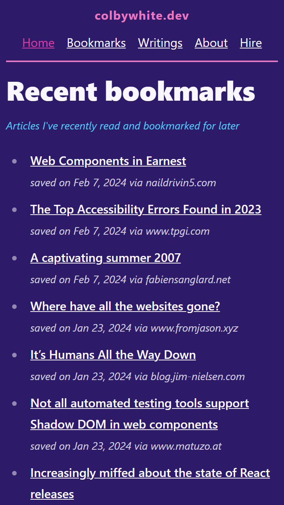

# Public Bookmarks

Quick project for publishing bookmarks to reference, and share interesting and informative link from another develop and decided to speed run making it.

The project is super simple, using Astro with default content management. Then deployed to Netlify

# Usage

## Development

1. `npm i`
2. `npm run dev`

## Adding new bookmarks

-   **CLI** `bin/create <URL> <slug> <...title>`
    -   ..
        -   **URL:** location of the bookmark
        -   **slug:** path safe filename
        -   **title:** any other params are slurped up into a title
    -   `bin/create https://example.com/ example The main example website everyone uses`
-   **Out of time** A web extension to auto add, or integration with [Raindrop](https://raindrop.io/)

# Prior Art

-   [Colby White](https://colbywhite.dev/)  
    
